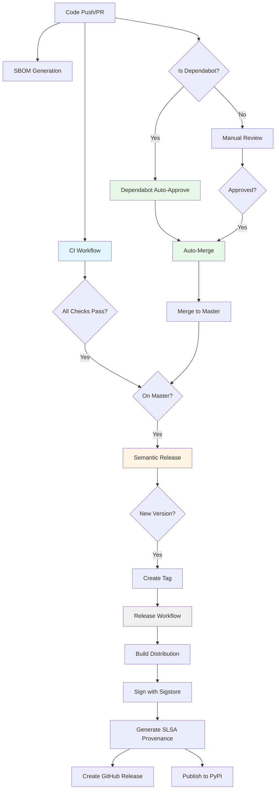

# CI/CD Pipeline Documentation

This document provides a comprehensive overview of all GitHub Actions workflows in the jankins project.

## Pipeline Status Dashboard

| Workflow | Status | Purpose |
|----------|--------|---------|
| **CI** | [](https://github.com/thecturner/jankins/actions/workflows/ci.yml) | Quality gates & testing |
| **SBOM** | [](https://github.com/thecturner/jankins/actions/workflows/sbom.yml) | Security compliance |
| **Semantic Release** | [](https://github.com/thecturner/jankins/actions/workflows/semantic-release.yml) | Automated versioning |
| **Release** | [](https://github.com/thecturner/jankins/actions/workflows/release.yml) | Package distribution |
| **Auto-Merge** | [](https://github.com/thecturner/jankins/actions/workflows/auto-merge.yml) | PR automation |
| **Dependabot** | [](https://github.com/thecturner/jankins/actions/workflows/dependabot-auto-approve.yml) | Dependency automation |

---

## Pipeline Flow Diagram



---

## Detailed Workflow Documentation

### 1. CI Workflow (`ci.yml`)

**Triggers:**
- Push to `master`/`main`
- Pull requests to `master`/`main`
- Weekly schedule (Sundays at midnight)

**Jobs:**

| Job | Description | Fails CI? |
|-----|-------------|-----------|
| **lint** | Runs ruff linter on src and tests | ✅ Yes |
| **type-check** | Runs mypy type checking | ✅ Yes |
| **security** | Bandit security scan | ⚠️ Continues on error |
| **codeql** | GitHub CodeQL analysis | ✅ Yes |
| **test** | Pytest on Python 3.10, 3.11, 3.12 | ✅ Yes |
| **dependency-review** | Custom vulnerability & license scanning | ✅ Yes (PRs only) |
| **ci-success** | Aggregates all job results | ✅ Yes |

**Features:**
- 🔍 Multi-version Python testing
- 📊 Code coverage reporting to Codecov
- 🛡️ Security scanning with Bandit and CodeQL
- 📦 Custom dependency review using pip-audit and Safety
- ✅ License compliance checking

**Dependencies:** None

---

### 2. SBOM Generation (`sbom.yml`)

**Triggers:**
- Push to `master`/`main`
- Pull requests to `master`/`main`
- Tags matching `v*.*.*`
- Weekly schedule (Sundays at midnight)

**Jobs:**

| Job | Description | Artifacts |
|-----|-------------|-----------|
| **sbom** | Generates Software Bill of Materials | CycloneDX JSON, SPDX JSON, pip-audit report |

**Features:**
- 📋 CycloneDX SBOM generation
- 📄 SPDX SBOM generation
- 🔍 Vulnerability scanning with pip-audit
- 💾 Commits SBOMs to `.sbom/` directory (master only)

**Dependencies:** None

---

### 3. Semantic Release (`semantic-release.yml`)

**Triggers:**
- Push to `master`/`main` branch only

**Jobs:**

| Job | Description | Outputs |
|-----|-------------|---------|
| **release** | Analyzes commits and creates versioned releases | Git tag, updated CHANGELOG.md |

**Features:**
- 🤖 Automatic version bumping based on conventional commits
- 📝 Changelog generation
- 🏷️ Git tag creation
- 🔄 Triggers release workflow via PAT_TOKEN
- 🛡️ Race condition prevention (skips if triggered by bot commits)

**Commit Types:**
- `fix:` → Patch version bump (1.2.3 → 1.2.4)
- `feat:` → Minor version bump (1.2.3 → 1.3.0)
- `BREAKING CHANGE:` → Major version bump (1.2.3 → 2.0.0)

**Dependencies:** None (triggers Release workflow)

**Important:** Requires `PAT_TOKEN` secret with `actions: write` permission to trigger the release workflow.

---

### 4. Release Workflow (`release.yml`)

**Triggers:**
- Git tags matching `v*.*.*`
- Manual workflow dispatch

**Jobs:**

| Job | Description | Artifacts |
|-----|-------------|-----------|
| **build** | Builds source distribution and wheel | dist/*.tar.gz, dist/*.whl |
| **sign** | Signs artifacts with Sigstore | dist/*.sigstore.json |
| **provenance** | Generates SLSA Level 3 provenance | SLSA attestation |
| **release** | Creates GitHub release with artifacts | GitHub Release |
| **publish-pypi** | Publishes to PyPI using trusted publishing | PyPI package |

**Features:**
- 🔐 Sigstore signing for supply chain security
- 📜 SLSA Level 3 provenance generation
- 📦 Trusted PyPI publishing (no API tokens needed)
- 📋 Automated release notes from CHANGELOG.md
- ✅ Full artifact verification chain

**Dependencies:** Triggered by Semantic Release workflow

**Security:**
- Uses OIDC trusted publishing to PyPI (no long-lived tokens)
- All artifacts are signed with Sigstore
- SLSA provenance provides verifiable build metadata

---

### 5. Auto-Merge (`auto-merge.yml`)

**Triggers:**
- Pull request opened/synchronized/reopened
- Pull request review submitted
- Check suite completed

**Jobs:**

| Job | Description | Actions |
|-----|-------------|---------|
| **auto-merge** | Checks PR approval and CI status, then merges | Auto-merge with squash |

**Features:**
- ✅ Verifies PR has approvals
- 🔍 Ensures all CI checks passed
- 🔄 Auto-merges when conditions met
- 📦 Uses squash merge strategy

**Requirements:**
- At least one approval
- All required checks must pass
- No failed or cancelled checks

**Dependencies:** Waits for CI workflow completion

---

### 6. Dependabot Auto-Approve (`dependabot-auto-approve.yml`)

**Triggers:**
- Pull requests from `dependabot[bot]` (using `pull_request_target`)

**Jobs:**

| Job | Description | Actions |
|-----|-------------|---------|
| **auto-approve** | Auto-approves and enables auto-merge for dependabot PRs | Approval + auto-merge flag |

**Features:**
- ✅ Auto-approves patch and minor updates
- ⚠️ Warns on major version updates (requires manual review)
- 🔄 Enables auto-merge for approved updates
- 🤖 Works seamlessly with Auto-Merge workflow

**Approval Rules:**
- `semver-patch` (1.2.3 → 1.2.4) → ✅ Auto-approve + auto-merge
- `semver-minor` (1.2.3 → 1.3.0) → ✅ Auto-approve + auto-merge
- `semver-major` (1.2.3 → 2.0.0) → ⚠️ Comment only, manual review required

**Dependencies:** Works in conjunction with Auto-Merge workflow

---

## Secrets Configuration

| Secret | Required For | Purpose | Permissions |
|--------|--------------|---------|-------------|
| `GITHUB_TOKEN` | All workflows | Standard GitHub Actions token | Auto-provided |
| `PAT_TOKEN` | Semantic Release | Trigger release workflow | `actions: write` |
| `CODECOV_TOKEN` | CI (optional) | Upload coverage reports | N/A |

**Note:** PyPI publishing uses OIDC trusted publishing, so no `PYPI_TOKEN` is needed.

---

## Development Workflow

### For Contributors

1. **Create feature branch**
   ```bash
   git checkout -b feature/my-feature
   ```

2. **Make changes with conventional commits**
   ```bash
   git commit -m "feat: add new feature"
   git commit -m "fix: resolve bug"
   ```

3. **Push and create PR**
   ```bash
   git push origin feature/my-feature
   gh pr create
   ```

4. **CI automatically runs**
   - Lint, type-check, security scan, tests
   - Dependency review (for PRs)
   - SBOM generation

5. **Get approval** (or auto-approved if Dependabot)

6. **Auto-merge when ready**
   - All checks pass
   - At least one approval
   - Auto-merged with squash

7. **Semantic Release creates version** (if applicable)
   - Analyzes commit messages
   - Bumps version
   - Updates CHANGELOG
   - Creates tag

8. **Release workflow publishes**
   - Builds package
   - Signs with Sigstore
   - Generates SLSA provenance
   - Publishes to PyPI
   - Creates GitHub release

---

## Troubleshooting

### Common Issues

#### CI Failing on Dependency Review
**Problem:** `dependency-review` job fails
**Solution:** Check for:
- Known vulnerabilities in dependencies (pip-audit output)
- Problematic licenses (GPL, AGPL, etc.)
- Review the GitHub Actions summary for details

#### Semantic Release Not Triggering
**Problem:** Merge to master but no release created
**Solutions:**
- Ensure commits follow conventional commit format
- Check if last commit was from `github-actions[bot]` (skipped to prevent loops)
- Verify `PAT_TOKEN` is configured with `actions: write` permission

#### Release Workflow Failing
**Problem:** Tag created but release fails
**Common causes:**
- Sigstore signing issues (usually temporary, retry)
- SLSA provenance job failure
- PyPI trusted publishing not configured

#### Auto-Merge Not Working
**Problem:** PR approved but not merging
**Check:**
- All required checks passed (no failures/cancellations)
- At least one approval exists
- PR is not a draft
- No merge conflicts

---

## Maintenance

### Updating Workflows

When modifying workflows:

1. **Test on feature branch first**
   ```bash
   git checkout -b fix/workflow-update
   # Make changes
   git push origin fix/workflow-update
   gh pr create
   ```

2. **Monitor the PR workflow run**
   - Ensure all jobs complete successfully
   - Check for any unexpected behavior

3. **Merge and verify on master**
   - Watch the semantic-release workflow
   - Verify release workflow if version bumped

### Security Best Practices

- ✅ Never commit secrets or tokens
- ✅ Use OIDC/trusted publishing where possible
- ✅ Pin action versions with SHA hashes (optional)
- ✅ Regular dependency updates via Dependabot
- ✅ Review Dependabot major version updates manually

---

## Additional Resources

- [Conventional Commits](https://www.conventionalcommits.org/)
- [Semantic Versioning](https://semver.org/)
- [SLSA Framework](https://slsa.dev/)
- [Sigstore](https://www.sigstore.dev/)
- [PyPI Trusted Publishers](https://docs.pypi.org/trusted-publishers/)
